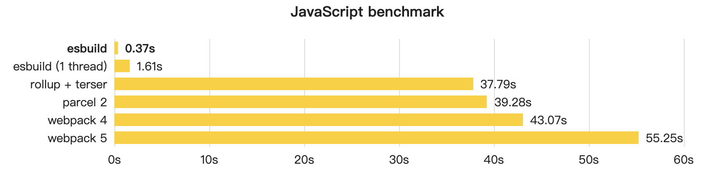
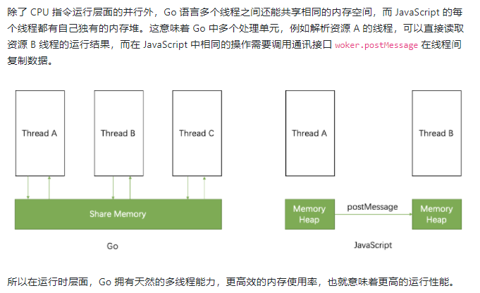
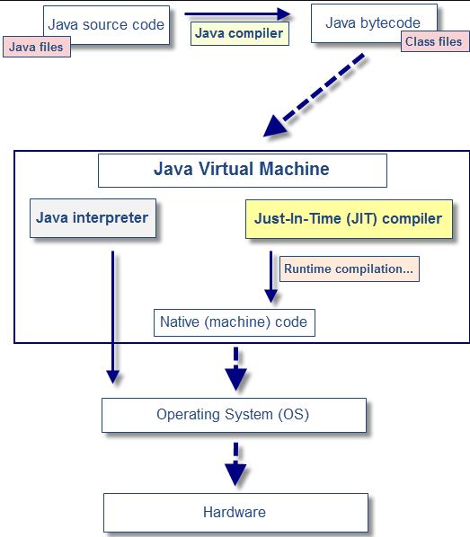
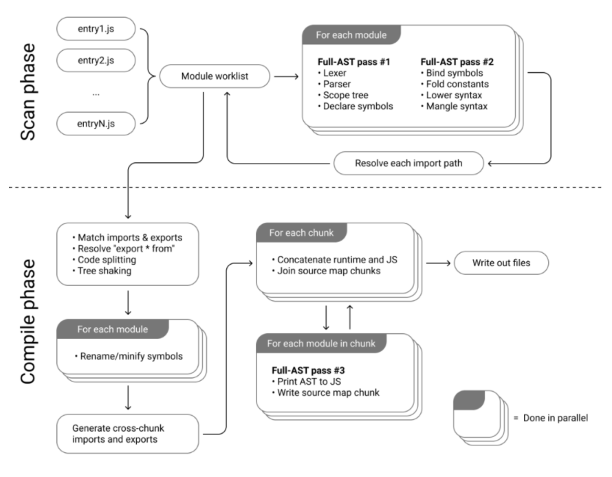

## 一：含义：<a href="https://esbuild.github.io/" target="_blank">Esbuild</a> 是一个非常快的 JavaScript 绑定器（An extremely fast JavaScript and CSS bundler and minifier）

<div align=center ></div>

## 二：Esbuild 原理

---

> `1`：esbuild 是用 Go 语言写的，并且编译为 native code。

<div align=center ></div>

> `2`：并行性被大量使用，打包大致分为三个阶段：解析、链接和代码生成。解析和代码生成是大部分工作，并且是完全可并行化的（链接在很大程度上是一个固有的串行任务）。

> `3`：Esbuild 重写大多数转译工具之后，能够在多个编译阶段共用相似的 AST 结构，尽可能减少字符串到 AST 的结构转换，提升内存使用效率。

> `4`：`即时编译（just-in-time compilation，缩写为 JIT）

<font color=#538cf5>explain: JIT 编译器会在程序已经开始执行后运行，它实时地对代码（通常是字节码或是某种 VM 指令）进行编译。借助着主机 CPU 的原生指令集，编译过程通常比较快速。</font>

<div align=center ></div>

## 三：打包过程

---

> - 3.1 利用 esbuild 编译代码

`esbuild 提供了 writeFileSync/writeFile 对 code 进行编译`

```
require('fs').writeFileSync('in.ts', 'let x: number =   1')
require('esbuild').buildSync({
 entryPoints: ['in.ts'],
 outfile: 'out.js',
})
```

> - 3.2 利用 esbuild 处理 jsx 代码

```
require('esbuild').transformSync('<div/>', {
  jsxFactory: 'h', //默认为 React.CreateElement,可自定义, 如果你想使用 Vue 的 jsx 写法, 将该值换成为 Vue.CreateElement
  loader: 'jsx', // 将 loader 设置为 jsx 可以编译 jsx 代码
})

// 同上，默认为 React.Fragment , 可换成对应的 Vue.Fragment。
require('esbuild').transformSync('<>x</>', {
  jsxFragment: 'Fragment',
  loader: 'jsx',
})
```

> - 3.3 利用 esbuild 压缩代码体积

`esbuild 提供了一个 minify 配置允许用户去压缩代码体积`

```
var js = 'fn = obj => { return obj.x }'
require('esbuild').transformSync(js, {
  minify: true,
})

// minify 后
{
  code: 'fn=n=>n.x;\n',
  map: '',
  warnings: []
}

```

> - 3.4 处理其他资源

> - 3.5 用 esbuild 启动一个 web server 用于调试（支持热更新）

```
require('esbuild').serve({}, {
  entryPoints: ['app.js'],
  bundle: true,
  outfile: 'out.js',
}).then(server => {
  // Call "stop" on the web server when you're done
  server.stop()
})
```

<div align=center ></div>

## 四：Esbuild API

> 4.1 `Transform API`

transform API 调用在单个字符串上运行，而不访问文件系统。这使得它非常适合在没有文件系统（如浏览器）的环境中使用，或者作为另一个工具链的一部分使用。<a href="https://esbuild.github.io/api/#transform-api" target="_blank">(点击查看相关配置)</a>

```
require('esbuild').transformSync('let x: number = 1', {
  loader: 'ts',
})

{
  code: 'let x = 1;\n',
  map: '',
  warnings: []
}
```

> 4.2 `Service API`

Service 的出现是为了解决调用上述 API 时都会创建一个子进行来完成的问题，如果存在多次调用 API 的情况出现，那么就会出现性能上的浪费。<a href="https://esbuild.github.io/api/#serve-everything" target="_blank">(点击查看相关配置)</a>

```
interface Service {
  build(options: BuildOptions): Promise<BuildResult>;
  transform(input: string, options?: TransformOptions): Promise<TransformResult>;
  stop(): void;
}
```

在实际使用上，我们并不是直接使用 Service 创建实例，而是通过 startService 来创建一个 Service 实例:

```
const {
  startService,
  build,
} = require("esbuild")
const service = await startService()

try {
  const res = await service.build({
    entryPoints: ["./src/main.js"],
    write: false
  })
  console.log(res)
} finally {
  service.stop()
}
```

> 4.3 `Build API`

构建 API 调用对文件系统中的一个或多个文件进行操作。这允许文件相互引用并捆绑在一起。
<a href="https://esbuild.github.io/api/#build-api" target="_blank">(点击查看相关配置)</a>

```
require('esbuild').build({
  entryPoints: ['in.ts'],
  outfile: 'out.js',
})

```

> 4.4 `BuildSync API`

buildSync 顾名思义，相比较 build 而言，它是同步的构建方式，即如果使用 build 我们需要借助 async await 来实现同步调用，而使用 buildSync 可以直接实现同步调用。

```
require('esbuild').buildSync({
 entryPoints: ['in.ts'],
 outfile: 'out.js',
})

```

## 五：插件 API<a href="https://github.com/esbuild/community-plugins" target="_blank">(点击查看 community-plugins)</a>

> <font color='#f53b3b' >插件 API 只能用于 Build API，不能用于 Transform API</font>

---

> ### 5.1：`简介`

插件 API 允许您将代码注入构建过程的各个部分。与 API 的其余部分不同，它不能从命令行获得。必须编写 JavaScript 或 Go 代码才能使用插件 API。插件也只能与构建 API 一起使用，而不能与转换 API 一起使用。
<a href="https://esbuild.github.io/api/#serve-everything" target="_blank">(点击查看 Plugins)</a>

> ### 5.2：`写插件`

esbuild 插件是具有名称和设置函数的对象。它们以数组形式传递给构建 API 调用。对于每个构建 API 调用，setup 函数运行一次。

```
let envPlugin = {
  name: 'env',
  setup(build) {
    // Intercept import paths called "env" so esbuild doesn't attempt
    // to map them to a file system location. Tag them with the "env-ns"
    // namespace to reserve them for this plugin.
    build.onResolve({ filter: /^env$/ }, args => ({
      path: args.path,
      namespace: 'env-ns',
    }))

    // Load paths tagged with the "env-ns" namespace and behave as if
    // they point to a JSON file containing the environment variables.
    build.onLoad({ filter: /.*/, namespace: 'env-ns' }, () => ({
      contents: JSON.stringify(process.env),
      loader: 'json',
    }))
  },
}

require('esbuild').build({
  entryPoints: ['app.js'],
  bundle: true,
  outfile: 'out.js',
  plugins: [envPlugin],
}).catch(() => process.exit(1))

```

> 5.2.1： `Name`

name 通用代表这个插件的名称

> 5.2.2： `Setup`

setup 里面编写插件逻辑，最后生成插件。

> 5.2.3： `Namespaces`

每个模块都有一个关联的命名空间。默认情况下，esbuild 在文件命名空间中运行，该命名空间对应于文件系统上的文件。但是 esbuild 也可以处理文件系统中没有相应位置的“虚拟”模块。发生这种情况的一种情况是使用标准输入法提供模块。<a href="https://esbuild.github.io/plugins/#namespaces" target="_blank">(点击查看相关配置)</a>

> 5.2.4：plugin 提供了四个钩子，按顺序执行分别是:onStart，onResolve，onLoad，onEnd

> ### 5.3：`如何解决插件与 loader 的执行顺序问题`

esbuild 中的 loader 是直接把某个格式的文件直接处理并返回，而插件 api 也具有接触文件内容的机会。

```
import fs from "fs";

export default {
  name: "env",
  setup(build) {
    build.onLoad({ filter: /\.tsx$/ }, async (args) => {
      const source = await fs.promises.readFile(args.path, "utf8");
      const contents = source.toString();
      //astHandle只能处理js内容，对ts或jsx不认识，编译报错
      const result = astHandle(contents)
      return {
        contents: result,
        loader: "tsx",
      };
    });
  },
};

```

从上面代码例子中看出，插件 api 在接受到文件内容后，并不能直接处理 tsx 的内容，因为我们可能不具备处理 tsx 的能力，这时候并不能显示定义插件在 tsx 转换成 js 之后执行。要想处理这种情况只能借助 esbuild 的 transform api 能力<a href="https://esbuild.github.io/api/#transform-api" target="_blank">(点击查看相关配置)</a>

```
import fs from "fs";
import esbuild from "esbuild";

export default {
  name: "env",
  setup(build) {
    build.onLoad({ filter: /\.tsx$/ }, async (args) => {
      const source = await fs.promises.readFile(args.path, "utf8");
      const contents = source.toString();
      const result = astHandle(esbuild.transformSync(contents, {
        loader: 'tsx',
      }))
      return {
        contents: result.code,
        loader: "tsx",
      };
    });
  },
};

```

> ### 5.4：`babel 迁移`

由于 babel 的社区插件较多，这给原本使用 babel 的项目迁移到 esbuild 设置了障碍，可以使用社区提供的 esbuild-plugin-babel 一键迁移，例如使用 antd 组件时需要配合使用 antd-plugin-import 插件，具体如下：

```
import babel from "esbuild-plugin-babel";
import esbuild from "esbuild";
import path, { dirname } from "path";
import { fileURLToPath } from "url";

const babelJSON = babel({
  filter: /\.tsx?/,
  config: {
    presets: ["@babel/preset-react", "@babel/preset-typescript"],
    plugins: [["import", { libraryName: "antd", style: "css" }]],
  },
});
const __dirname = dirname(fileURLToPath(import.meta.url));

esbuild
  .build({
    entryPoints: [path.join(__dirname + "/app.tsx")],
    outdir: "out",
    plugins: [babelJSON],
  })
  .catch(() => process.exit(1));

```

> ### 5.5：<a href="https://esbuild.github.io/plugins/#namespaces" target="_blank">插件 API 限制</a>

此 API 并不打算涵盖所有用例。不可能连接到捆绑过程的每个部分。例如，目前无法直接修改 AST。存在此限制是为了保持 esbuild 的出色性能特征，并避免暴露过多的 API 表面，这将是维护负担并会阻止涉及更改 AST 的改进。

将 esbuild 视为网络的“链接器”的一种方式。就像本地代码的链接器一样，esbuild 的工作是获取一组文件，解析和绑定它们之间的引用，并生成一个包含所有链接在一起的代码的单个文件。插件的工作是生成最终被链接的单个文件。

esbuild 中的插件在相对范围内且仅自定义构建的一小部分时效果最佳。例如，自定义格式（例如 YAML）的特殊配置文件的插件就非常合适。你使用的插件越多，你的构建就会越慢，特别是如果你的插件是用 JavaScript 编写的。如果插件适用于您构建中的每个文件，那么您的构建可能会非常缓慢。如果缓存适用，则必须由插件本身完成。

## 六：本项目插件编写流程

---

> 1: npm init

> 2: 创建 index.js，引入 esbuild

```
const { build } = require('esbuild');
```

> 3: 定义入口文件(entryPoints)和打包输入的目录和文件(outfile)

> 4: 自定义 API

```
build({
           entryPoints: [path.resolve(__dirname, './src/index.js')],
           outfile: path.resolve(__dirname, './dist', fileName), //path
           external: ['fs'],
           bundle: true,
           minify: true,
           platform: 'node',
           format: key,
           target: 'es2020',
       })
```

> 5: 编写插件 replace

> 6: 使用 jest 编写测试用例去测试插件的正确性

<center><font color='#33dae6'>(欢迎查看源代码)</font></center>

## 七：官网没有计划支持的特性:

- Elm, Svelte, Vue, Angular 等代码文件格式
- Ts 类型检查
- AST 相关操作 API
- Hot Module Replace
- Module Federation(模块联合)
